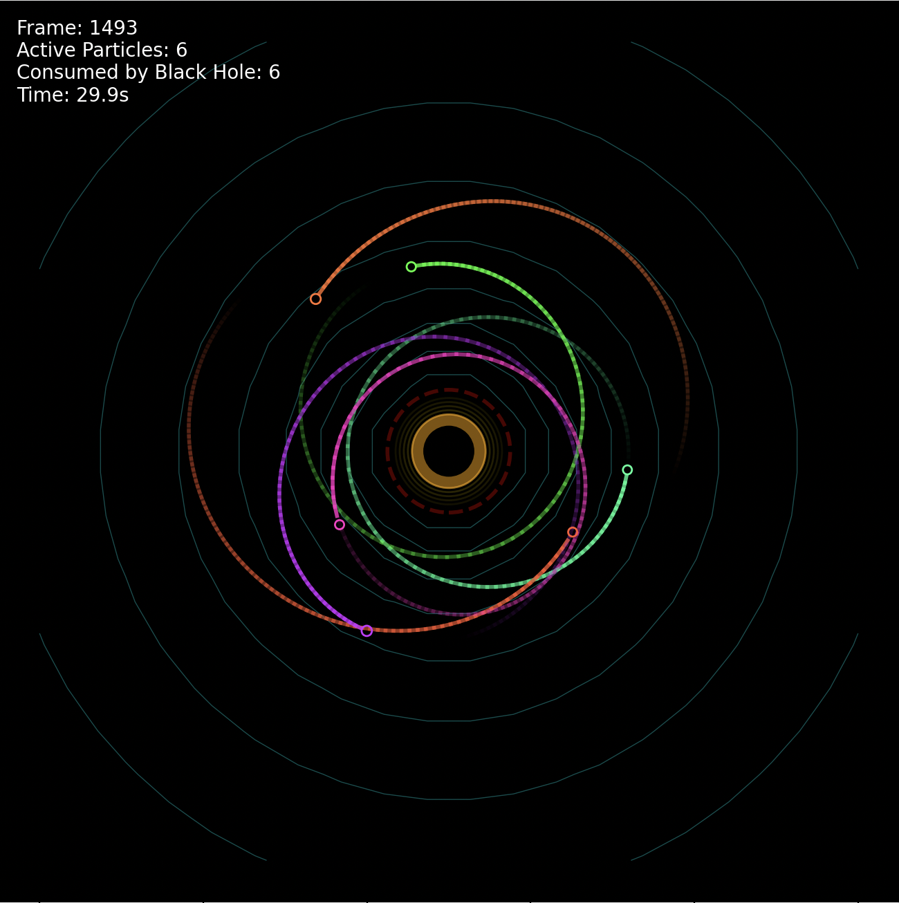

# Black Hole Simulation with Dust Physics

A realistic black hole simulation featuring gravitational physics, particle dynamics, dust clouds, and stunning visualizations using Python.

## Screenshot



_The simulation showing gravitational field lines, particle trajectories, event horizon, and accretion disk effects_

## Features

🌌 **Realistic Physics**

- Gravitational force calculations
- Event horizon and Schwarzschild radius
- Photon sphere visualization
- Relativistic effects near the black hole

🎨 **Advanced Visualization**

- Gravitational field contours
- Particle trails with gradient effects
- Dynamic dust particle clouds
- Temperature-based dust coloring
- Real-time statistics display
- Accretion disk visualization
- Color-coded particles

⚡ **Interactive Elements**

- Multiple particle systems (orbital, random, binary)
- Dynamic dust generation and physics
- Particle collisions and interactions
- Stellar wind effects
- Real-time animation
- Performance optimized rendering

## Installation

1. Clone or download this repository
2. Install required dependencies:

```bash
pip3 install -r requirements.txt
```

## Usage

Run the simulation:

```bash
python3 run_simulation.py
```

### Controls

- **Close window**: Stop the simulation
- **Watch**: Particles spiral into the black hole with realistic physics

## What You'll See

- **Cyan contour lines**: Gravitational field strength
- **Red dashed circle**: Photon sphere (unstable orbit boundary)
- **Orange circle**: Event horizon (point of no return)
- **Gold rings**: Accretion disk effect
- **Colored particles**: Various masses and velocities
- **Dust clouds**: Small particles with temperature-based colors
- **Gradient trails**: Particle path history
- **Statistics panel**: Real-time simulation data
- **Dynamic effects**: Stellar wind, collisions, dust capture

## Physics Explained

### Black Hole Components

- **Schwarzschild Radius**: The event horizon where escape velocity equals light speed
- **Photon Sphere**: The boundary where photons can orbit the black hole
- **Accretion Disk**: Matter spiraling into the black hole

### Particle Behavior

- **Orbital Particles**: Start in semi-stable orbits around the black hole
- **Random Particles**: Enter from simulation boundaries with various trajectories
- **Binary System**: Two particles orbiting each other while approaching the black hole
- **Dust Particles**: Small particles forming accretion disk and stellar wind
- **Particle Interactions**: Collisions create dust and exchange momentum
- **Dust Capture**: Larger particles can capture nearby dust and grow

## Technical Details

### Files

- `black_hole.py`: Core simulation engine with physics calculations
- `run_simulation.py`: Main script with particle initialization
- `requirements.txt`: Python dependencies

### Key Classes

- `BlackHole`: Gravitational source with event horizon
- `Particle`: Individual objects affected by gravity
- `BlackHoleSimulation`: Physics engine and time stepping
- `BlackHoleVisualizer`: Matplotlib-based visualization

### Parameters You Can Modify

- Gravitational constant (for visual effect)
- Number of particles
- Simulation boundaries
- Animation speed
- Trail length

## Educational Value

This simulation demonstrates:

- General relativity concepts
- Orbital mechanics
- Gravitational interactions
- N-body physics simulations
- Dust cloud dynamics
- Accretion disk formation
- Particle collision physics
- Temperature effects
- Scientific visualization techniques

## Requirements

- Python 3.7+
- NumPy
- Matplotlib

## Performance

The simulation is optimized for real-time visualization with:

- Efficient particle updates
- Smart trail management
- Optimized rendering pipeline
- Configurable frame rates

Enjoy exploring the fascinating physics of black holes! 🚀
